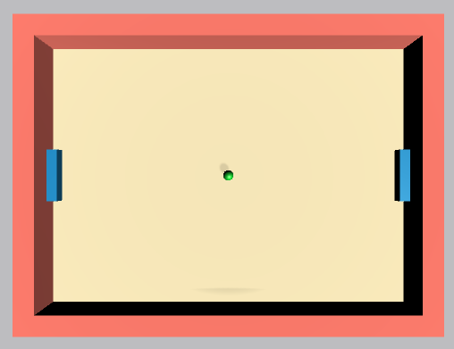

# Unity Machine Learning Agent

## Introduction

This is repository for **Unity Machine Learning Agent** and **Reinforcement Learning(RL)**.

Unity release awesome tool for making reinforcement learning environment! [Unity Machine Learning](https://unity3d.com/machine-learning)

I usually make 2D RL environment with [pygame](http://www.pygame.org/news). [pygame environment repository](https://github.com/Kyushik/DRL)

Thanks to Unity, I am trying to make some 3D RL Environments.

I wrote summary of RL algorithms in [pygame environment repository](https://github.com/Kyushik/DRL)


Some of the environment made by purchased models. In this case, it is hard to provide raw unity codes. However, there are some simple environments which are made by simple or free model. I will provide raw unity codes for those environments if I solve the capacity problem.


### Environment

**Software**
* Windows7 (64bit), Ubuntu16.04
* Python 3.5.2
* Anaconda 4.2.0
* Tensorflow-gpu 1.3.0
* Unity version 2017.2.0f3 Personal
* opencv3 3.1.0

**Hardware**
* CPU: Intel(R) Core(TM) i7-4790K CPU @ 4.00GHZ
* GPU: GeForce GTX 1080Ti
* Memory: 8GB
* ​


## Unity ML Environments

### Vehicle Environment(Static Obstacles)


 

 The agent of this environment is vehicle. Obstacles are static tire barriers. If vehicle hits obstacle, it gets minus reward and game restarts. If vehicle hits start, it gets plus reward and game goes on.  The specific description of the environment is as follows.

- [Specific description of the environment](https://github.com/Kyushik/Unity_ML_Agent/blob/master/VehicleEnv_static.md)


Sample video of this game is as follows.

Game demo [youtube video](https://youtu.be/-LbuCPwiSVY) 

Above demo, referenced papers to implement algorithm are as follows.

- [Noisy Networks for Exploration](https://arxiv.org/abs/1706.10295)
- [Deep Reinforcement Learning with Double Q-learning](https://arxiv.org/abs/1509.06461)


The download links of this environments are as follows.

- Car Game Static Obs Windows [Link](https://www.dropbox.com/s/eaxq55kjm80nnsp/ML_Agent_VehicleEnvironment_static_windows.zip?dl=0)
- Car Game Static Obs Mac [Link](https://www.dropbox.com/s/8gl0fa11rbwvqaz/ML_Agent_VehicleEnvironment_static_mac.zip?dl=0)
- Car Game Static Obs Linux [Link](https://www.dropbox.com/s/1ubddebgl11ggft/ML_Agent_VehicleEnvironment_static_linux.zip?dl=0)

---

### Pong




This is simple and popular environment for testing deep reinforcement learning algorithms.

Two bars have to hit the ball to win the game.  In my environment, left bar is `agent` and right bar is `enemy`. Enemy is invincible, so it can hit every ball.  In every episode, ball is fired in random direction.

```
The rules of the pong are as follows.
- Agent hits the ball: reward +1
- Agent misses the ball: reward -1

Terminal conditions
- Agent misses the ball
- Agent hit the ball 5 time in a row
```

The download links of this environments are as follows.

- Pong Windows [Link](https://www.dropbox.com/s/j7ib4k6f64gw1ft/ML_Agent_Pong_Windows.zip?dl=0)
- Pong Mac [Link](https://www.dropbox.com/s/8dci73a65wa8kuu/ML_Agent_Pong_Mac.zip?dl=0)
- Pong Linux [Link](https://www.dropbox.com/s/ren5lob8877iuby/ML_Agent_Pong_Linux.zip?dl=0)