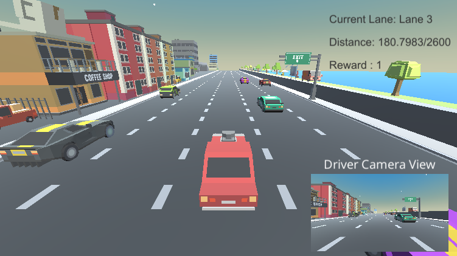
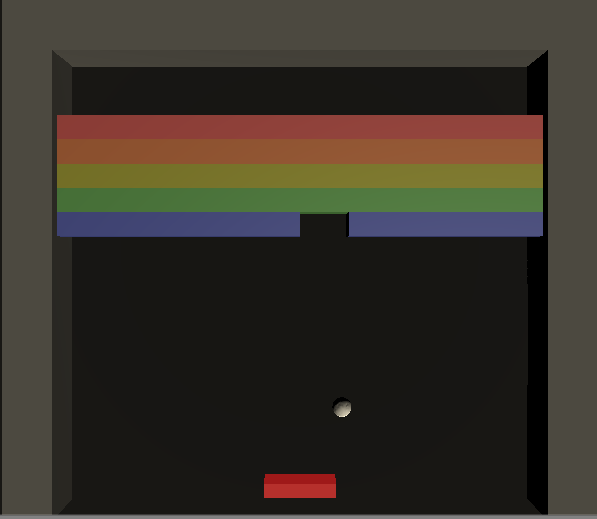
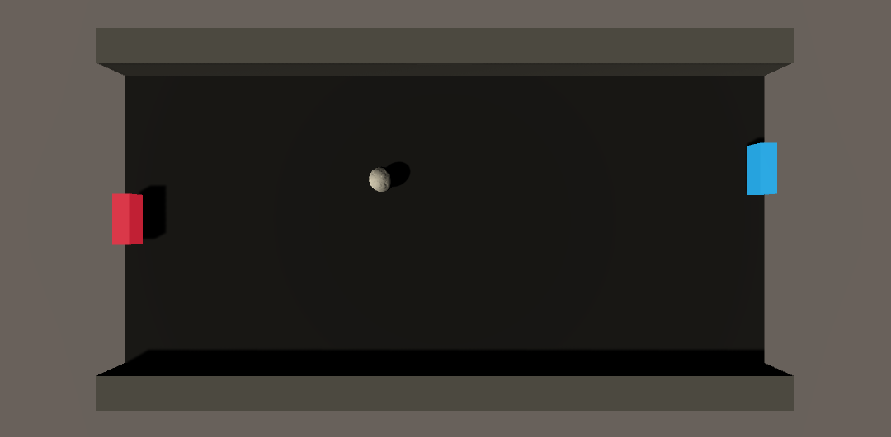
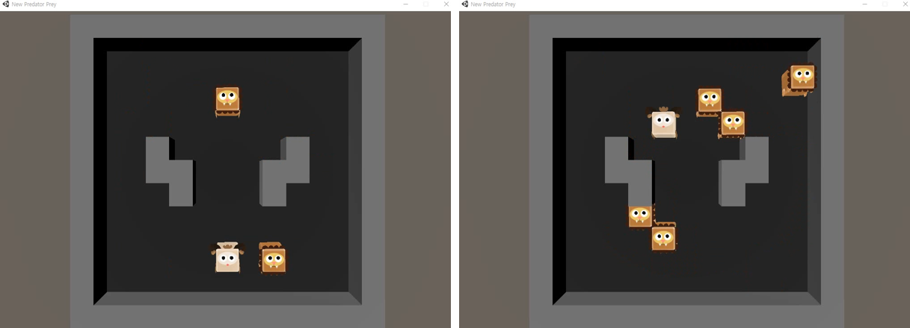

# Unity Machine Learning Agent

## Introduction

This is repository for **Unity Machine Learning Agent** and **Reinforcement Learning(RL)**.

Unity release awesome tool for making reinforcement learning environment! [Unity Machine Learning](https://unity3d.com/machine-learning)

[pygame environment repository](https://github.com/Kyushik/DRL)


Some of the environment made by purchased models. In this case, it is hard to provide unity codes. However, there are some simple environments which are made by simple or free model. I will provide unity codes for those environments.


### Environment

**Software**
* Windows10 (64bit), Ubuntu16.04
* Python 3.6.5
* Anaconda 4.2.0
* Tensorflow-gpu 1.12.0
* Unity version 2017.2.0f3 Personal
* Unity ML-Agents: 0.8.1

**Hardware**

* CPU: Intel(R) Core(TM) i7-4790K CPU @ 4.00GHZ

* GPU: GeForce GTX 1080Ti

* Memory: 8GB

  

## Unity ML Environments

### Deep Q Learning Based High Level Driving Policy Determination


This project was one of the project of [Machine Learning Camp Jeju 2017](http://mlcampjeju.kakao.com/).

After the camp, simulator was changed to [Unity ML-Agents](https://unity3d.com/machine-learning). 

Published papers using the environment

- [2018 IEEE Intelligent Vehicle Symposium](https://ieeexplore.ieee.org/abstract/document/8500645)
- [Transaction on Intelligent Vehicles](https://ieeexplore.ieee.org/abstract/document/8723635)

The Repository link of this project as follows. 

[Repository Link!!!](https://github.com/MLJejuCamp2017/DRL_based_SelfDrivingCarControl)

---

### Vehicle Environment(Dynamic Obstacles)



 

 The agent of this environment is vehicle. Obstacles are other 8 different kind of vehicles. If vehicle hits other vehicle, it gets minus reward and game restarts. If vehicle hits start, it gets plus reward and game goes on.  The specific description of the environment is as follows.

```
- State: Game View (80x80x1 grayscale image)
- Action: 3 Actions (Left, Right, stay)
- Reward 
	- Driving at the center of the lane: +1 (linearly decrease)
	- Collide with other vehicles (-10)
```


**Demo video:**  [youtube link](https://www.youtube.com/watch?v=n3GD2OjM2_k) 


Above demo, referenced papers to implement algorithm are as follows.

- [Dueling Network Architectures for Deep Reinforcement Learning](https://arxiv.org/abs/1511.06581)

---

### Vehicle Environment(Static Obstacles)


 

This environment won [ML-Agents Challenge](https://blogs.unity3d.com/kr/2018/02/28/introducing-the-winners-of-the-first-ml-agents-challenge/?_ga=2.161712891.672728060.1524014504-1436221211.1493602207)!!! :crown:


 The agent of this environment is vehicle. Obstacles are static tire barriers. If vehicle hits obstacle, it gets minus reward and game restarts. If vehicle hits start, it gets plus reward and game goes on.  The specific description of the environment is as follows.

- [Specific description of the environment](https://github.com/Kyushik/Unity_ML_Agent/blob/master/docs/VehicleEnv_static.md)


**Demo video:**  [youtube link](https://youtu.be/-LbuCPwiSVY) 


Above demo, referenced papers to implement algorithm are as follows.

- [Noisy Networks for Exploration](https://arxiv.org/abs/1706.10295)
- [Deep Reinforcement Learning with Double Q-learning](https://arxiv.org/abs/1509.06461)

---

### Breakout




This is breakout environment, which is popular environment for testing RL algorithm. 

The red bar (agent) moves left and right side to hit the ball. If the ball collides with a block, it breaks the block.  In every episode, ball is fired in random direction.

```
The rules of the breakout are as follows.
- Visual Observation: 80x80x1 grayscale image  
- Actions: 3 actions (left, stay, right)

+1 Reward
- If ball breaks a block, the agent gets +1 reward 

-1 Reward
- If the agent misses the ball, the agent gets -1 reward

Terminal conditions
- If the agent misses the ball 
- If the agent breaks all the blocks 
```


---

### Pong




This is simple and popular environment for testing deep reinforcement learning algorithms.

Two bars have to hit the ball to win the game.  In my environment, left bar is `agent` and right bar is `enemy`. Enemy is invincible, so it can hit every ball.  In every episode, ball is fired in random direction.

```
The rules of the pong are as follows.
- Visual Observation: 40x80x1 grayscale image 
- Vector Observation: 32 
- Actions: 3 actions (up, stay, right)

- Agent hits the ball: reward +0.5
- Agent misses the ball: reward -1

Terminal conditions
- Agent misses the ball
- After 1000 time steps, the episode ends
```


---

### Predator Prey (MultiAgent)




This is popular environment for testing **Multi Agent** deep reinforcement learning algorithms. The lions and a sheep are `agents`. Lions are predator, so they have to capture the sheep. Sheep is prey, so it has to run away from the lions.  

```
The rules of the Predator Prey are as follows.
- Visual Observation: 80x80x3 image 
- Vector Observation: 3 -> x position, z position, role(0: Prey, 1: Predator) 
- Actions: 4 actions (up, down, left, right)

Reward (Predator)
- Every move: -0.01 
- Predator captures the prey: +1 

Reward (Prey)
- Every move: +0.01
- Predator captures the prey: -1

Terminal conditions
- Predator captures the prey 
- After 500 steps
```

