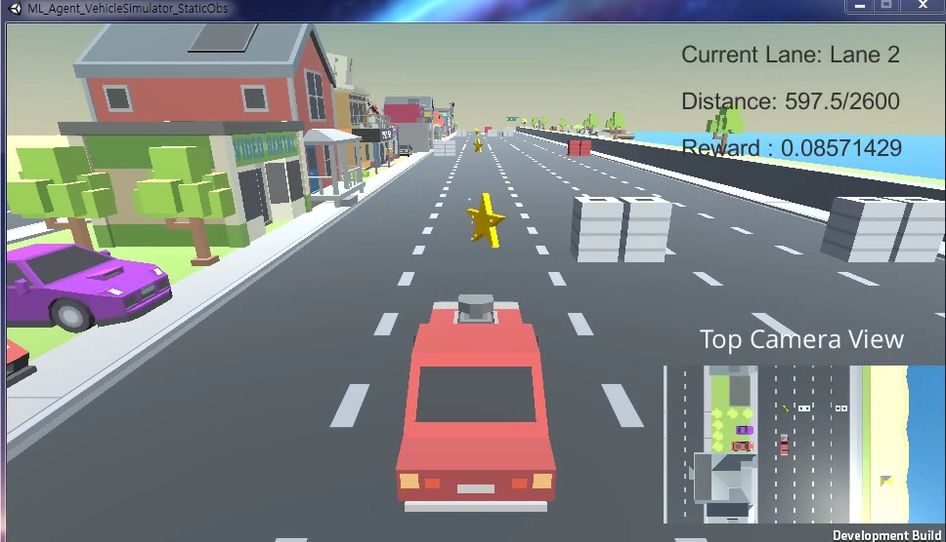
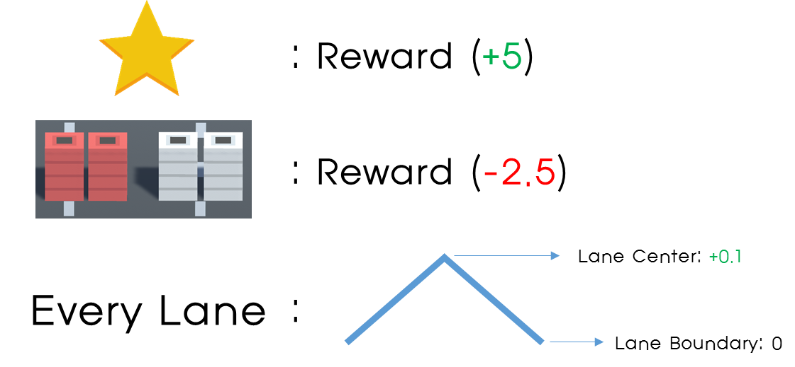

# Vehicle Environment (Static Obstacles)

 

This simulator is simple vehicle environment. In this environment, Agent should evade obstacle and get stars while keeps center of the lane.

**Objects** of this environment are as follows.

- Agent: red vehicle in the camera center
- Obstacles: red and white tire barriers which randomly generates at the lane center in every episode
- stars: stars which randomly generates at the lane center in every episode

**Actions** of the environments are as follows.

The actions of the agent are as follows.

- Move Left to a certain distance
- Move Right to a certain distance
- Stay current state

**Reward** of the environments are as follows.

As above image, if agent hits star, it gets +5 reward. However, agent hits tire barriers, it gets -2.5 reward. In the case of the lane, agent gets +0.1 at the center of every lane. If agent gets far from lane center, reward linearly decrease to 0.  

According to the reward, **the goal of the agent** is keep center of the lane and gets stars while evading tire barriers.

**Terminal Conditions** of the environments are as follows.

- Agent hits tire barrier
- Agent arrives end of the map (distance: 2600) 

